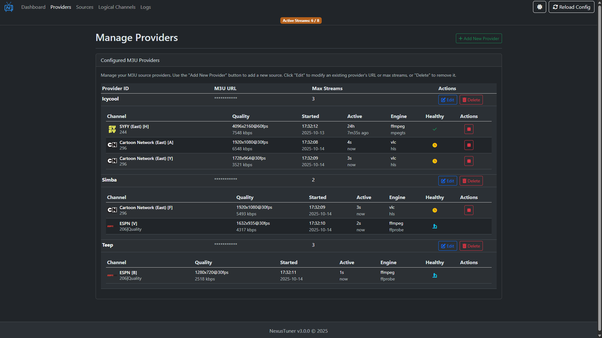
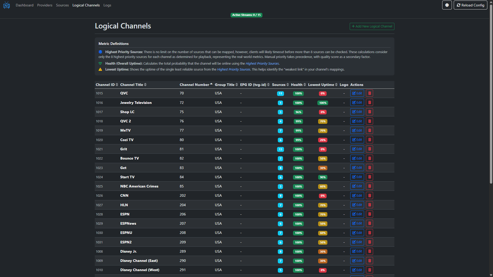
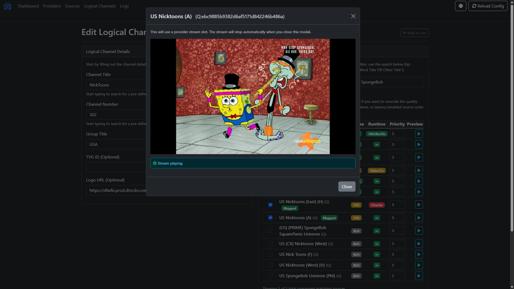
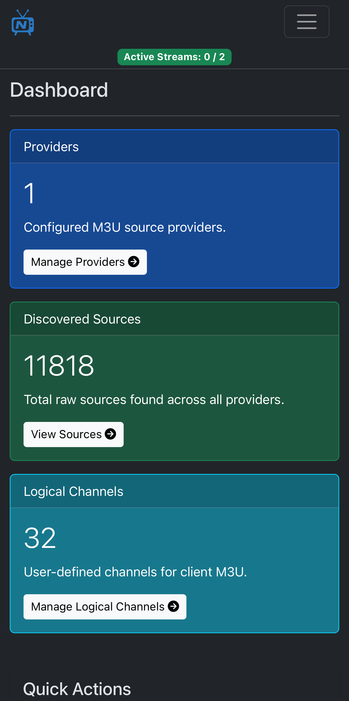

# NexusTuner

[](https://github.com/Fahmula/nexus-tuner/releases/latest)
[](https://github.com/Fahmula/nexus-tuner/blob/main/LICENSE)

`NexusTuner` is a smart, self-hosted IPTV proxy that aggregates multiple M3U sources into a single, stable, and feature-rich playlist for your media clients.

> [!TIP]
> **Key Features:**
> * **Web-Based UI:** A modern, user-friendly UI with PWA support to manage providers, create logical channels, map sources, and view application logs. Mapping channels has never been easier with automatic suggestions and prefilled data to make the setup process frictionless. Additionally, sources mapped to other logical channels will be marked as `In Use` or `Duplicated` if it's also mapped to the current channel.
> * **M3U Aggregation:** Combine multiple IPTV provider playlists into one unified and consistent channel lineup. Each provider can be configured with their maximum concurrent streams, which `NexusTuner` will manage intelligently.
> * **`In-Browser Previews:`** Easily preview streams directly in your browser while configuring channels or from the `Sources` page. No more guesswork and fiddling with external players to check stream region and language.
> * **`Automatic Quality Monitoring:`** `NexusTuner` continuously monitors the health of each source along with its resolution, bitrate, and framerate. No more endless tinkering to find the best source, just select them all and `NexusTuner` automatically chooses the highest quality and most reliable stream from your configured sources when a channel is requested. Additionally, you can use metrics such as `Uptime`, `Runtime`, and `Offset (Relative Delay)` from your sources so you can curate the perfect viewing experience.
> * **`Fast & Reliable Streams:`** When a channel is requested, `NexusTuner` starts multiple mapped sources in parallel (respecting each provider's limit). It then quickly selects the best healthy stream based on priority and quality, leading to faster, more reliable, and more consistent channel startup times. Additionally, it will automatically switch to another source if the current one fails, ensuring uninterrupted viewing.
> * **`Dead Source Detection:`** Once configured, your channel lineup remains stable and consistent to your media clients, even if you completely change Providers or remove all source mappings. Additionally, `NexusTuner` automatically detects dead mapped sources (e.g. stream url changed) and intelligently tries to remap them based on their tvg data. If it's not possible, channels with dead sources will be logged and marked in the UI with a convenient button to remove them. In any case, you will never need to remap a channel in your media clients unless you've deleted the logical channel itself.
> * **`On-the-Fly Remux:`** All streams are processed via FFmpeg/VLC to produce an HLS or MPEGTS format, maximizing compatibility across a wide range of media client devices and applications. Each stream type also supports sharing the same process for multiple simultaneous connections automatically, reducing resource usage and provider slot usage.
> * **HDHomeRun Server:** `NexusTuner` can act as an HDHomeRun server, allowing you to use your IPTV channels with compatible media clients that support HDHomeRun such as Plex, Emby, Jellyfin, and more.
> * **Ghost Session Cleanup:** Integrates with Emby and Jellyfin to detect and terminate "ghost" streams, processes that are still running after a media client has disconnected improperly, freeing up valuable provider slots.


## Dashboard


## Providers


## Logical Channels


## Edit Logical Channel With Preview


## Dashboard Mobile


## Getting Started

> [!NOTE]
> This application can be run using docker or directly using python.

### Install `NexusTuner`

#### With Docker

Use the compose file and instructions provided here: [docker-compose.yml](docker-compose.yml).

#### Without Docker

For non-docker users, install python 3.13 or later and run the following commands:

```bash
git clone https://github.com/Fahmula/nexus-tuner.git
cd nexus-tuner
python3.13 -m venv venv

venv/bin/pip install -r requirements.txt      # Linux/macOS
venv\Scripts\pip install -r requirements.txt  # Windows
```

> [!IMPORTANT]
> You'll need to install FFmpeg (and optionally VLC) separately on your system, you'll be able to
> configure the paths in the `.env` file later. ffprobe will be inferred from the FFmpeg path.

### Configuring `NexusTuner`

You can set the environment variables on your system, in the docker compose file, or in the `.env` file.
> [!WARNING]
> Values from your system or the docker compose file will override the `.env` file.

#### Create the Environment File

For docker users, your config directory will be your mount to `/config`.

For non-docker users, create a directory anywhere on your system to use as your config directory.

Copy the example environment file at [env.example](env.example) to `config/.env`.

#### Edit the Environment File

There are two baseline options you need to set:

1. **`NEXUS_URL`**: The base URL where your `NexusTuner` instance will be accessible.
2. **`NEXUS_PORT`**: The port `NexusTuner` will listen on

Non-docker users will also need to set two more options:

3. **`NEXUS_CONFIG_DIR`**: The directory where `NexusTuner` will store its configuration files.
4. **`NEXUS_FFMPEG_PATH`**: The path to the FFmpeg executable on your system.
5. **`NEXUS_VLC_PATH`**: The path to the VLC executable on your system (optional).

Here are all the available environment variables:

| Variable                               | Description                                                                                             | Example                               |
| :------------------------------------- | :------------------------------------------------------------------------------------------------------ | :------------------------------------ |
| **`NEXUS_CONFIG_DIR`** (Required)      | The directory where `NexusTuner` will store its configuration files.                                    | `/path/to/config/folder/nexus-tuner`  |
| **`NEXUS_URL`** (Required)             | The full URL of your `NexusTuner` instance, without the port. Used for UI and building playlist URLs.   | `http://192.168.1.100`                |
| **`NEXUS_STREAM_ENGINE`** (Required)   | The stream processing engine to use. Options are `ffmpeg` or `vlc`.                                     | `ffmpeg`                              |
| **`NEXUS_FFMPEG_PATH`** (Required)     | The path to the FFmpeg executable on your system. Used for processing streams.                          | `/usr/bin/ffmpeg`                     |
| `NEXUS_VLC_PATH`                       | The path to the VLC executable on your system. Used for processing streams.                             | `/usr/bin/vlc`                        |
| `NEXUS_PORT`                           | The internal port the application listens on.                                                           | `4040`                                |
| `NEXUS_REMOVE_CAPTIONS_AND_SUBTITLES`               | Whether to remove subtitles from the processed streams. Options are `true` or `false`.                  | `false`                                |
| `NEXUS_PROCESS_INACTIVITY_TIMEOUT`     | Seconds of inactivity before a stream is stopped. Inactive streams will be pruned earlier when needed.  | `900`                                 |
| `NEXUS_PROCESS_LOGS_RETENTION_SECONDS` | How long to keep process logs in seconds.                                                               | `86400`                               |
| `NEXUS_LOG_BACKUP_COUNT`               | Number of days of log backups to keep.                                                                  | `7`                                   |
| `NEXUS_BACKUP_COUNT`                   | Number of days of config backups to keep. Each backup is `<1MB` in size.                                | `30`                                  |
| `NEXUS_GHOST_SESSION_CHECK_INTERVAL`   | Interval in seconds to check Jellyfin/Emby servers for ghost sessions.                                  | `60`                                  |
| `NEXUS_EMBY_URL`                       | (Optional) URL for your Emby server to enable ghost session cleanup.                                    | `http://emby.local:8096`              |
| `NEXUS_EMBY_API_KEY`                   | (Optional) API key for your Emby server.                                                                | `your_emby_api_key`                   |
| `NEXUS_JELLYFIN_URL`                   | (Optional) URL for your Jellyfin server to enable ghost session cleanup.                                | `http://jellyfin.local:8096`          |
| `NEXUS_JELLYFIN_API_KEY`               | (Optional) API key for your Jellyfin server.                                                            | `your_jellyfin_api_key`               |

### Run `NexusTuner`

#### With Docker

Run the application using the docker-compose.yml:

```bash
docker compose up -d
```

#### Without Docker

> [!IMPORTANT]
> Ensure you are in the directory you cloned earlier that contains `app.py`.
> You do not need to activate the virtual environment for running the application.

Run the following command, replacing `NEXUS_PORT` and `NEXUS_CONFIG_DIR` with the values you set in your `.env` file:

```bash
venv/bin/uvicorn app:app --workers 1 --log-level warning --host 0.0.0.0 --port NEXUS_PORT --env-file "NEXUS_CONFIG_DIR/.env"
```

Schedule `NexusTuner` to run on startup using your system's service manager (e.g. systemd, launchd, Task Scheduler).

### Configuring Channels

> [!TIP]
> On your IPTV service, select all the channels that correspond to the regions and languages you want to include in your unified playlist.
> You will map specific sources to your configured logical channels in `NexusTuner`, perform only the bare minimum filtering on your IPTV
> service (e.g. only US channels) for the best experience.

* Open a web browser and navigate to the `NEXUS_URL` and `NEXUS_PORT` you configured (e.g. `http://192.168.1.100:4040`).
* Navigate to the **Providers** page and add your M3U source providers.
  * Return to the Dashboard and click `Reload Providers & Sources` to discover the sources from your configured providers.
* Navigate to the **Logical Channels** page to create your desired channel lineup.
  * As you type in the channel name or number, `NexusTuner` will display suggestions to prefill the channel data.
  * You can map as many sources as you like. You can also preview each source to ensure they are correct.
  * If a source is mapped to another logical channel, it will be marked as `In Use` or `Duplicated` if it's also mapped to the current channel.
  * You can optionally trigger an early run of `Quality Monitor` for this channel only if you'd like to start using it immediately.

### Configuring Your Media Clients

> [!NOTE]
> `NexusTuner` supports unlimited simultaneous streams for the same channel, even if your media client does not support it natively. Also, if a source dies during viewing, it will automatically failover to the next best source.

The best way to use `NexusTuner` is through the `HDHomeRun` interface, which is supported by many media clients including Plex, Emby, and Jellyfin.
`NexusTuner` should automatically be detected by your media client applications if they are on the same network. Otherwise, follow the instructions
for your specific media client application to add an `HDHomeRun` tuner by specifying the `NEXUS_URL` and `NEXUS_PORT`.

`NexusTuner` also provides a standard M3U playlist that can be used in any media client application that supports it. For an application
like VLC, you can use the M3U playlist URL: **`<NEXUS_URL>:<NEXUS_PORT>/playlist.m3u`**

### Updating `NexusTuner`

#### With Docker

Pull the latest image and restart the container from the directory where you have your `docker-compose.yml` file:

```bash
docker compose pull
docker compose up -d
```

#### Without Docker

Pull the latest changes using git and reinstall the requirements from the nexus-tuner directory cloned earlier:

```bash
git pull
venv/bin/pip install -r requirements.txt      # Linux/macOS
venv\Scripts\pip install -r requirements.txt  # Windows
```

## Development

Contributions are welcome! This project follows the [Conventional Commits](https://www.conventionalcommits.org/en/v1.0.0/) specification for all commit messages to ensure a clear and automated versioning and changelog process.
